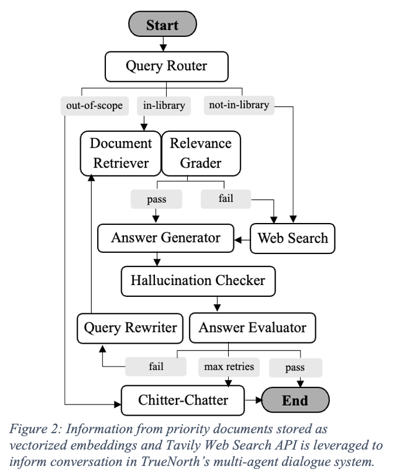

# 💜 TrueNorth – PERMA+4 Enhanced Agentic RAG for Long-term Conversational Assistance and Retention Engagement


TrueNorth is an AI-powered support assistant designed to empower early-career professionals pioneering the cutting-edge STEM industry. It provides a safe and anonymous space for mentorship, career guidance, emotional support, and navigating high-stakes workplace situations.

---
## ✨ Features

- 🤖 **Conversational Agent** built with Google Gemini for empathetic and informative support  
- 🔍 **Multi-query Retrieval-Augmented Generation (RAG)** with MMR and RRF for accurate answers  
- 📚 **Custom Vector Database** using Postgres or Langchain FAISS Local Vector Store to index curated resources and books  
- 🌐 **Tavily Web Search** integration for current, real-world information  
- ✅ **Answer Verification** using hallucination and relevance grading  
- 🧠 **Query Rewriting** for improving search coverage  
- 🎨 **Streamlit Frontend** with a feminine and empowering aesthetic  

---

## 🛠️ Tech Stack

| Component    | Technology                              |
|--------------|------------------------------------------|
| LLM          | Google Gemini (via `langchain_google_genai`)|
| Vector Store | PostgresDB or Langchain FAISS Local Vector Store        |
| Embeddings   | GoogleGenerativeAIEmbeddings             |
| Frontend     | Streamlit and FastAPI                    |
| Web Search   | Tavily API                               |
| Orchestration| LangGraph                                |

---

## Poetry Setup

Create a local virtual environment with Poetry using
```
poetry config virtualenvs.in-project true
```
Then, `cd` into the directory that contains pyproject.toml and poetry.lock. Install the poetry environment with this terminal command:
```
poetry install
```
Now you can update your virtual environment that Poetry made:
```
source .venv/bin/activate
```

## Environment Setup
You need an `.env` file with these values set up:
```
export GEMINI_API_KEY="something"
export DEFAULT_GOOGLE_PROJECT="something"
export GOOGLE_CLOUD_LOCATION=us-central1
...
```

...check out `.env.example` for a file you can copy.

# Setup
## 📚 1. Preprocess & Embed  PDFs

Before running the chatbot, convert your PDFs into searchable vector embeddings:

```python Knowledge.py```

⏳ This process may take 20+ minutes depending on the number and size of PDFs. Data is uploaded to the PostgreSQL vectorstore (pgvector).


## 📡 2. Launch Chatbot API (FastAPI)

Start the backend server (runs on port 8000):

`poetry run uvicorn truenorth.app:app --reload`

### 🔗 API Docs

Once running, access the API docs and test endpoints at:

```http://localhost:8000/docs```

This Swagger UI lets you test Streamlit UI programmatically and inspect endpoint responses.

## 🌸 3. Launch the Streamlit UI

In a separate terminal, start the frontend (runs on port 8501):

```streamlit run streamlit_ui.py```

Then go to your browser:

`http://localhost:8501`

This interface connects to the API and provides an interactive chatbot experience.

## 📐 4. Evaluation Workflows
TrueNorth implements a comprehensive evaluation framework with 14 distinct metrics organized into two categories:

### ✅ Conversational Agent (Statkus et al., 2024)

- **Anthropomorphism** - Human-like interaction quality
- **Attractivity** - Visual appeal and engagement
- **Identification** - User relatability and connection
- **Goal Facilitation** - Support for user objectives
- **Trustworthiness** - Reliability and credibility
- **Usefulness** - Practical value and helpfulness
- **Accessibility** - Ease of access and interaction

✅ Meta-Requirements for Individualized STEM Support:

- **MR1**: Gender-Conscious Engagement - Avoids stereotypes, fosters gender diversity respect
- **MR2**: Empathic Intuition - Emotionally aware and naturally caring responses
- **MR3**: Personal Visual Engagement - Personalized context and interactive elements
- **MR4**: Credibility & Relatability - Reliable information delivered in relatable tone
- **MR5**: Inclusive Community - Encourages belonging in diverse environments
- **MR6**: User Agency - Empowers autonomous decision-making
- **MR7**: Cognitive Simplicity - Reduces information processing complexity

Run full evaluation:

`python src/design_evaluator.py`

Outputs are saved to:

`agentic_evaluation_results.csv`

Each row shows binary scores for each design quality.

# ✅ Makefile Usage

If `make` is installed, you can simplify operations with:

🔧 Local setup (no Docker)

```
make install        # Install dependencies using Poetry
make embed          # Preprocess PDFs into vector DB
make api            # Launch FastAPI backend (http://localhost:8000)
make ui             # Launch Streamlit frontend (http://localhost:8501)
make test           # Run chatbot API tests using predefined test cases and similarity matric
make eval           # Run evaluation metrics for features Anthropomorphism, Attractivity, Identification, Goal Facilitation, Trustworthiness, Usefulness, Accessibility
```

# Docker Configuration

Make sure to install Docker
`https://docs.docker.com/desktop/setup/install/mac-install/`

# Creating an env and docker-compose.yml

Use the env.example and insert your keys!
In order for the backend, TrueNorth and Discord to connect, we will need to create a docker-compose.yml and dockerfile for Python

docker-compose.yml
https://docs.docker.com/reference/compose-file/services/#volumes

Dockerfile
https://docs.docker.com/get-started/docker-concepts/building-images/writing-a-dockerfile/

```
When inside the TrueNorth folder,

docker-compose build                #Build the docker image using the docker build command
docker-compose up -d                #Reads the docker-compose.yml file
docker-compose exec truenorth bash  #Run the interactive bash shell

```
